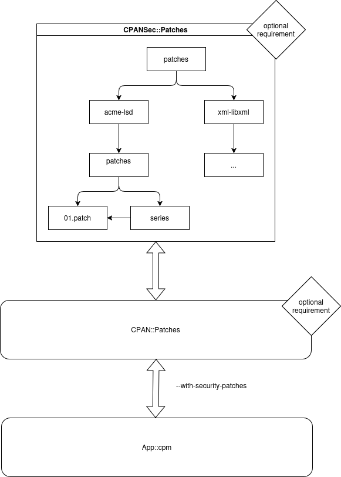

# CPANSec Patch Tooling POC
1. Patches distributed in seperate distribution [patches](CPANSec-Patches/lib/patches/)
2. Use (existent) patch tooling [CPAN::Patches](https://metacpan.org/pod/CPAN::Patches) from CPAN
3. Opt in apply in cpm (`--with-security-fixes`) - [patch applied after fetch](https://github.com/thibaultduponchelle/cpansec-patch-tooling-poc/blob/main/cpm/lib/App/cpm/Worker/Installer.pm#L216-L225)

Notes:
- Non-POC version should use [CPAN::Distroprefs](https://metacpan.org/pod/CPAN::Distroprefs) (not implemented)
- Should be optional requirements in cpm (not implemented)
- An example of patch - [CPANSec-Patches/lib/patches/acme-lsd/patches](CPANSec-Patches/lib/patches/acme-lsd/patches)
- Patches should remain compatible out of CPAN installers (for distribution packagers to apply with their own tooling)

## CPAN::Distroprefs
- distroprefs/
  - pref.yml 
- patches/
  - patch.patch (referenced by pref) 

Characteristics:
- In core
- More flexibility (can match version or not)

## CPAN::Patches
- patches/
  - acme-module/
    - patches/
      - patch.patches
      - series (list patches to apply)

Characteristics:
- Not in core
- Match module (no version)

## Schema


## Resources
- [Fixing a Perl module during CI workflow](https://briandfoy.github.io/fixing-a-perl-module-in-the-middle-of-a-github-workflow/)
- [Tuto CPAN::Distroprefs](https://briandfoy.github.io/a-cpan-distroprefs-example/)

## HOWTO
### Install patches
```
$ perl Makefile.PL
$ make 
$ make dist
$ cpm install --global CPANSec-Patches-0.01.tar.gz
```

### Install with patches
```
$ rm ~/.perl-cpm/ -rf; cpm install Acme::LSD --with-security-patches --reinstall
```

### Run
```
$ perl -I local/lib/perl5/ -MAcme::LSD -e 'print "aAaAaAaAaAa" x100;'
```


